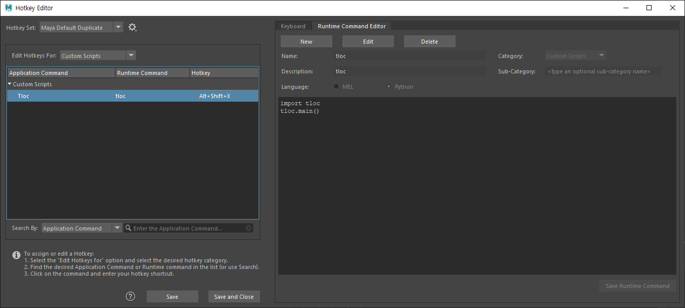

# TLOC

## What does it do
"T"riangulate + "Loc"ator. TLOC helps you to triangulate points with ease.

>  
> [Youtube - TLOC Guide](https://youtu.be/DLYFI9C9MoQ)

## Installation
1. Copy **tloc.py** to:
    - Windows
        > \Users\USERNAME\Documents\maya\scripts 
    - Mac
        > $HOME/maya/scripts
    - Linux
        > $HOME/maya/scripts
1. In Maya
    1. Open **Hotkey Editor** (Windows > Settings/Preferences > Hotkey Editor)
    1. Create a new 'Runtime Command'
        > 
    1. Set Hotkey
        > `Alt + Shift + X`
    1. Save and Close
